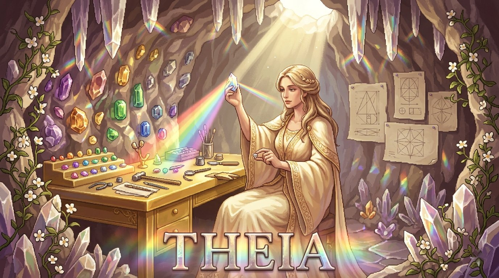

<p align="center">
  
</p>

<h1 align="center">Theia</h1>

<p align="center">
  <strong>Design Titan for UI/UX, Component Architecture, and Accessibility</strong><br>
  52 design systems, 66 component patterns, 58 WCAG criteria, and 62 decision rules. She sees the perfect interface before a single pixel is placed.
</p>

<p align="center">
  <a href="LICENSE"></a>
  <a href="https://www.python.org/downloads/"></a>
  <a href="https://modelcontextprotocol.io"></a>
  <a href="https://ko-fi.com/rezraa"></a>
</p>

---

## Why

Design tools help you build interfaces. Theia tells you whether the interface you are building is correct.

She carries a structured knowledge base of design systems, component patterns, accessibility standards, and decision rules that map structural signals to the right design approach. You describe what you are building. She audits it, plans the system, specs the components, evaluates accessibility, and logs every decision with rationale.

She knows Material Design 3, Apple HIG, Carbon, Fluent 2, Spectrum, Lightning, Polaris, Primer, Atlassian, Atomic Design, and Gestalt principles cold. She knows WCAG 2.1 and 2.2 at the criterion level. She thinks in tokens, components, and systems, not one off screens.

Accessibility is not optional. That is the line in the sand.

Named after the Titan of sight and divine radiance. Mother of Helios the sun, Selene the moon, and Eos the dawn. She sees everything.

## Knowledge Base

Structured design intelligence, not vibes.

| Category | Count | What |
|----------|-------|------|
| Design systems | 52 | Atomic Design, Design Thinking, Material Design 3, Apple HIG, Ant Design, Carbon, Fluent 2, Spectrum, Lightning, Polaris, Primer, Atlassian, Bootstrap, Chakra, Tailwind. Plus typography scales, color theory, token systems, layout patterns, motion curves. |
| Component patterns | 66 | Forms (15), data display (15), navigation (9), overlays (4), actions (5), feedback (11), layout (7). Each with anatomy, states, variants, accessibility requirements. |
| Accessibility standards | 58 | WCAG 2.1 and 2.2 Level A (35 criteria) and AA (23 criteria). Each with techniques, common failures, testing methods, affected disabilities, and whether it can be automated. |
| Decision rules | 62 | Signal to pattern mappings across 10 categories: layout, navigation, forms, feedback, data display, accessibility, animation, color, responsive, typography. |

8 design system categories. 7 component categories. 4 WCAG principles. 10 rule categories.

## Tools

| Tool | What it does |
|------|-------------|
| `audit_design` | Analyzes an interface for design issues, pattern mismatches, and accessibility violations. Detects 12 built in anti patterns like color only indicators, missing labels, small touch targets, no focus indicators, and low contrast. |
| `plan_design_system` | Architects a complete design system from scratch. Returns token architecture (spacing, type scale, color, elevation, motion), component hierarchy following Atomic Design, responsive strategy, and theming approach. Adjusts for platform. |
| `spec_component` | Generates a full component specification. States, variants, accessibility annotations, responsive behavior, design tokens, and common mistakes. Covers 8 built in archetypes: button, input, modal, card, data table, navigation, select, toast. |
| `evaluate_accessibility` | Audits WCAG compliance against Level A, AA, or AAA. Checks 14 accessibility signals, flags violations, calculates a compliance score, and recommends automated testing tools like axe core, Lighthouse, WAVE, and pa11y. |
| `log_decision` | Records design decisions with context, choice, alternatives considered, and rationale. 18 decision categories from component and layout to typography and deprecation. Append only log for full traceability. |

## Anti Patterns

Theia detects 12 common design anti patterns out of the box:

| Signal | What it catches |
|--------|----------------|
| color-only | Information conveyed only through color with no secondary indicator |
| no-labels | Form inputs without visible labels |
| small-touch-targets | Interactive elements below minimum touch target size |
| no-focus-indicator | Missing or invisible focus states for keyboard navigation |
| auto-play | Media that plays automatically without user consent |
| no-alt-text | Images without alternative text |
| low-contrast | Text or UI elements that fail contrast ratio requirements |
| no-keyboard-access | Interactive elements unreachable by keyboard |
| missing-error-messaging | Form errors without clear, accessible messaging |
| inconsistent-navigation | Navigation patterns that change across pages |
| no-skip-link | Pages without skip navigation links |
| motion-heavy | Excessive animation without reduced motion support |

## Token Architecture

When Theia plans a design system, she generates a complete token architecture:

| Token Layer | What it covers |
|-------------|---------------|
| Spacing | 11 value scale from 0px to 64px based on a 4px/8px grid |
| Typography | 10 value type scale from caption to display using a modular ratio |
| Color | Semantic tokens (primary, secondary, error, warning, success, info) with light and dark scheme support |
| Elevation | 6 levels from flat to highest with shadow definitions |
| Motion | Duration tokens (instant to slow) with easing curves (ease out, ease in out, spring) |

## Quick Start

### Install

```bash
git clone https://github.com/rezraa/theia.git
cd theia
python3 -m venv .venv && source .venv/bin/activate
pip install -e ".[dev]"
```

### Run Tests

```bash
pytest
# 76 tests, all passing
```

### Configure with Claude Code

Add to your project's `.mcp.json`:

```json
{
  "mcpServers": {
    "theia": {
      "command": "/path/to/theia/.venv/bin/python3",
      "args": ["-m", "theia.server"],
      "cwd": "/path/to/theia",
      "env": {
        "PYTHONPATH": "src"
      }
    }
  }
}
```

Then in Claude Code:

```
/design audit this interface and check WCAG compliance
```

## Architecture

```
Claude Code (top level LLM) -> invokes /design agent
  +-- Theia Agent (reasoning via persona + skill instructions)
       +-- Theia MCP Tools (audit, plan, spec, evaluate, log)
            +-- Knowledge Base (JSON)
                 |-- design_systems.json (52 systems)
                 |-- component_patterns.json (66 patterns)
                 |-- accessibility_standards.json (58 criteria)
                 +-- decision_rules.json (62 rules)
```

Dual mode: all tools accept an optional `conn` parameter. Without it, Theia runs standalone on local JSON. With it (inside Othrys), she reads from and writes to the shared Kuzu graph. Same logic, richer data.

## Project Structure

```
theia/
+-- src/theia/
|   |-- server.py              # MCP server
|   |-- tools/
|   |   |-- audit_design.py         # Interface auditing
|   |   |-- plan_design_system.py   # System architecture
|   |   |-- spec_component.py       # Component specifications
|   |   |-- evaluate_accessibility.py # WCAG compliance
|   |   +-- log_decision.py         # Decision recording
|   |-- knowledge/
|   |   |-- design_systems.json
|   |   |-- component_patterns.json
|   |   |-- accessibility_standards.json
|   |   |-- decision_rules.json
|   |   |-- loader.py              # Knowledge retrieval
|   |   +-- graph_loader.py        # Graph mode loader
+-- .claude/
|   |-- agents/theia.md        # Agent persona
|   +-- skills/design/         # Skill workflow
+-- tests/                     # 76 tests
+-- pyproject.toml
```

## Part of Othrys

Theia is one of the Titans in the [Othrys](https://github.com/rezraa/othrys) summoning engine. Standalone, she audits interfaces and plans design systems for any project. Inside Othrys, her decisions feed into the shared graph and her component specs connect to architecture decisions (Coeus), test strategies (Themis), and security reviews (Hyperion).

## Support

If Theia is useful to your work, consider [buying me a coffee](https://ko-fi.com/rezraa).

## Author

**Reza Malik** | [GitHub](https://github.com/rezraa) | [Ko-fi](https://ko-fi.com/rezraa)

## License

Copyright (c) 2026 Reza Malik. [Apache 2.0](LICENSE)
